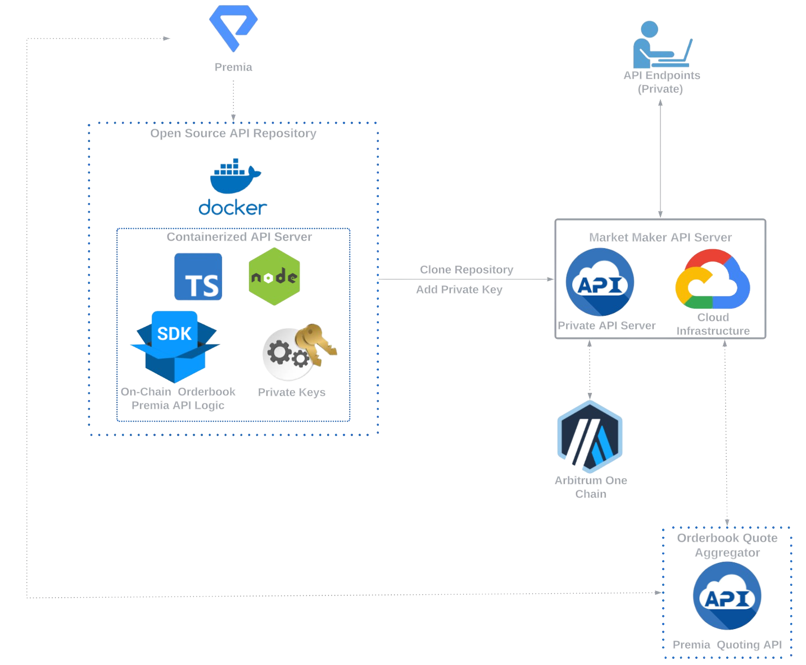

# Premia Orderbook API

This repo contains the source code for a containerized API that can be run locally (or hosted on a server) to 
interact with the Premia v3 Orderbook and related functionality for both professionals (market makers) and other 
advanced users.  The containerized API allows for development in any language.  Web3 functionality is abstracted away 
from the developer, shortening integration time.

## Architecture
