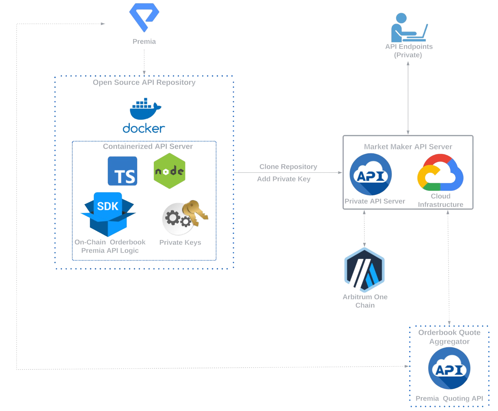

  

## What is Premia?
Premia is a peer-to-peer options exchange and settlement engine built for the Ethereum Virtual Machine (EVM). 
The protocol is designed to provide a set of smart contracts that advance open finance by prioritizing security, 
self-custody, automatic execution without a trusted intermediary, and permissionless use of financial primitives.

## Premia Orderbook API
This repo contains the source code for a runtime-agnostic Docker-containerized API to  interact with the Premia v3 Orderbook and related protocol functionality for both professionals (market makers) and other advanced/programmatic users.   
The containerized API allows for development in _any_ language. Web3 functionality is abstracted away from the developer, shortening integration time.
Additional API methods (see `/account/*`) are available for developer's convenience.
Check Open API 3.1 format API docs here: [openapi.yaml](openapi.yaml).

## Prerequisites
There are several things that are needed in order to work with the API locally. They include:

- An EOA (Externally Owned Account) on the Ethereum (funded on Arbitrum) with a wallet provider such as [Metamask](https://metamask.io/)
- An API Key from Premia (please email _support@premia.finance_ and use subject line 'API KEY REQUEST')
- Latest version of [Docker](https://docs.docker.com/get-docker/)
- An RPC provider (such as [Alchemy](https://www.alchemy.com/) or [Infura](https://www.infura.io/))

Example of required env. variables to be specified by API user: [.env.example](.env.example)

## Architecture

  

## How to Start Guide
1. Clone this repo
2. Populate .env (local runtime) or specify env. variables on the host machine to be readable for the container
3. Build and run the image
   - For local runtime, we recommend to use [Docker Compose](https://docs.docker.com/compose/). From the repo root directory, run command in your terminal `docker-compose up` to build and run the container, and `docker-compose down` to stop it.
   - For remote runtime, you can either build the image locally and push to the remote Docker image registry or fork the repo and set CI/CD pipeline in the cloud. Please email _support@premia.finance_ if you have questions about cloud deployment.
